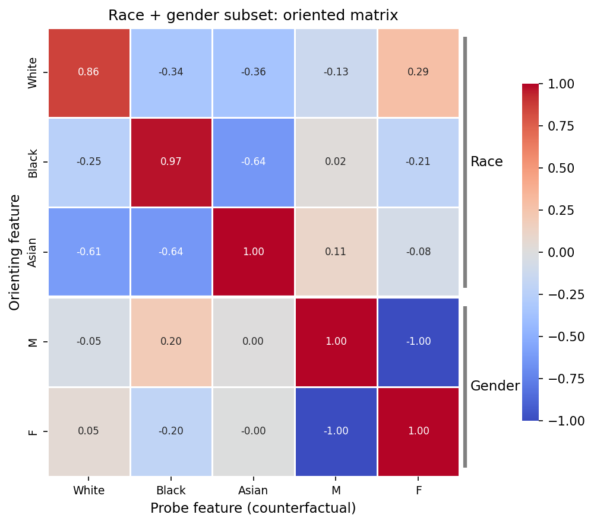
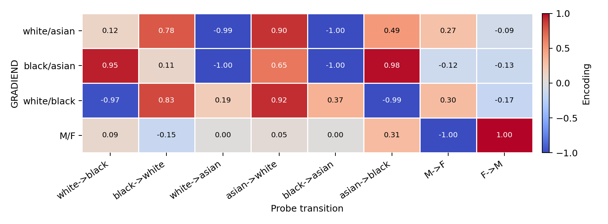
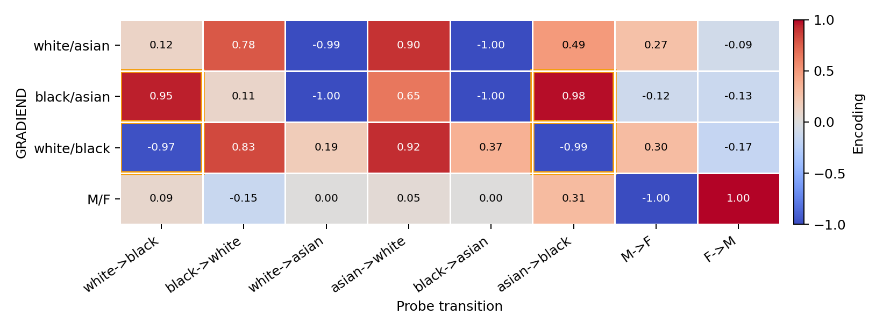
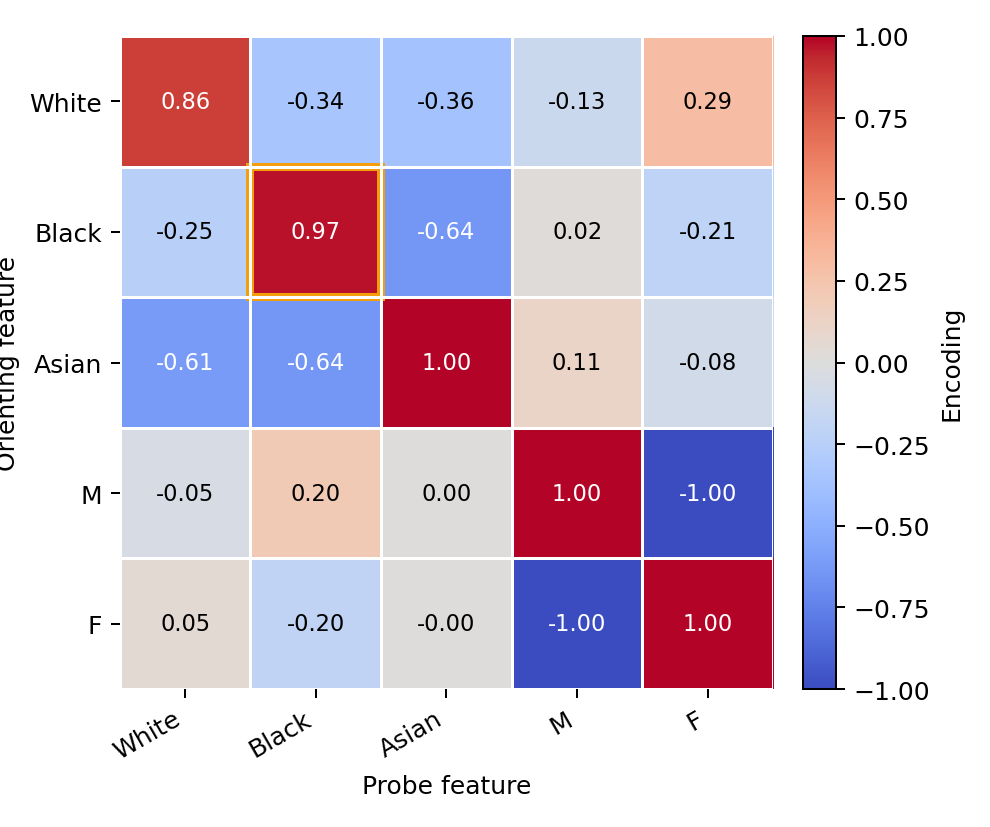
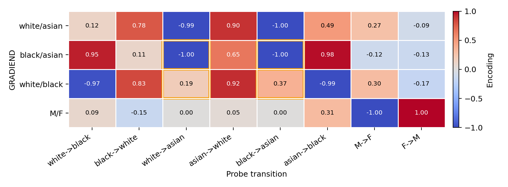

# Oriented cross-encoding matrix

The main idea of the *cross-encoding* matrix is *how* GRADIEND models trained over a diverse range of feature families encode *all* feature classes.

This aggregation also overcomes the problem of pairwise GRADIENDs seen in the topk overlap plots, where we use pairwise GRADIENDs corresponding to a pair of feature classes on the axis. However, this means that these plots compare two feature pairs with each other, which may become complicated.
The cross-encoding matrix instead operates directly on feature classes by aggregating the means of all GRADIENDs trained on that feature class.
We treat the encoding as a measure of how similar the feature classes are represented in the base model.
The following guide explains how to compute the matrix and how to interpret it.

**Computation details:** [Oriented cross-encoding: computation](cross-encoding-matrix-computation.md)  
**Formal notation:** [Oriented cross-encoding matrix (paper Appendix D)](https://arxiv.org/abs/2602.23993)

!!! note "Planned null controls"
    Cross-encoding currently provides descriptive matrices and seed-level
    dispersion, but no permutation or matched null analysis. The planned
    controls and expected result schema are documented under
    [Null controls (planned)](cross-encoding-matrix-computation.md#null-controls-planned).

---

## Computation

The workflows below are for **dense** matrices when many pairwise GRADIENDs share a
large feature domain.


The **full demo**
[multilingual_gradiend_demo.py](https://github.com/aieng-lab/gradiend/blob/main/experiments/multilingual_gradiend_demo.py)
used for the Python package paper adds pronouns, religion, sentiment, and the
complete German case grid.

Note that there is also a **small demo**
[multilingual_gradiend_demo_small.py](https://github.com/aieng-lab/gradiend/blob/main/experiments/multilingual_gradiend_demo_small.py) which includes only a few feature families.

**Core plotting pattern:**

```python
from gradiend import build_cross_task_encoder_summary, plot_cross_encoding_heatmap

feature_classes = ["white", "black", "asian", "M", "F"]

encoder_summary = build_cross_task_encoder_summary(
    trainers_by_id, # dict of ids mapping to its trainer
    split="test",
    max_size=config.args.encoder_eval_max_size,
)
plot_cross_encoding_heatmap(
    trainers_by_id,
    feature_classes,
    alignment="counterfactual",
    encoder_summary=encoder_summary,
    output_path="cross_encoding_oriented_counterfactual_heatmap.pdf",
)
```


> When you only deal with a *single* feature and train all GRADIENDs using a SymmetricTrainerSuite, you can directly use
[`suite.plot_cross_encoding_heatmap()`][gradiend.trainer.suite.base.TrainerSuite.plot_cross_encoding_heatmap], see
[Trainer suites](trainer-suites.md) and
[train_race_symmetric_suite.py](https://github.com/aieng-lab/gradiend/blob/main/gradiend/examples/train_race_symmetric_suite.py).




Rows are *orienting features*: each row combines the GRADIENDs that contain that feature.
Columns are *probe features*: the `Asian` column averages examples changed into `Asian`; the `M` column averages examples changed into `M`; and so on.

---

## Race + Gender Aggregation Example

To understand how the aggregation to feature classes works, this walkthrough uses the race + English gender subset of the multilingual demo
outputs. This example includes three [race GRADIENDs](https://github.com/aieng-lab/gradiend/blob/main/gradiend/examples/train_race_symmetric_suite.py)
(`race_white_asian`, `race_black_asian`, `race_white_black`) plus the English
gender GRADIEND ([`gender_en`](https://github.com/aieng-lab/gradiend/blob/main/gradiend/examples/train_gender_en.py), ordered `M/F`).

### GRADIEND x Transition

Cross-encoding starts by evaluating every trained GRADIEND on the same transition pool, meaning every GRADIEND model is evaluated on every transition used during the training of any considered GRADIEND in that matrix. 
This gives a GRADIEND × transition table: each row is one trained GRADIEND, and each column is a directed input transition such as
`white→asian`, `black→asian`, or `M→F`. Normal encoding evaluation only evaluates the model on the transition pool used during training (i.e., the diagonal of the matrix).



### Diagonal cell `(Black, Black)`

We now trace the aggregation for `(Black, Black)`, which appears as `0.97` in
the matrix above.

Because the GRADIENDs used for this example are trained with counterfactual
inputs, this aggregation uses input transitions with `Black` as the
counterfactual class. With factual-input GRADIENDs, it would instead use
transitions with `Black` as the factual class.

We also consider all GRADIEND models involving the `Black` feature. This gives
two GRADIEND models and two input transitions, resulting in four selected cells.



An important detail to consider for aggregating the GRADIEND models is the sign of the encoded feature.
During training of GRADIEND `F1<->F2`, the encoder is normalized to assign `+1` to the first class `F1` and `-1` to the second class `F2`. 
Hence, we need to align the sign of the encoded feature to be positive for the selected orienting feature, which we do with the so-called *anchor sign*.

The anchor sign differs across the two contributing GRADIENDs: `black` is the
first class in `race_black_asian` (`+1`) and the second class in
`race_white_black` (`-1`). After applying these signs, the four contributions
are consistently positive:

| GRADIEND | Transition | Raw mean | Anchor sign | Signed value |
|----------|------------|---------:|------------:|-------------:|
| race_black_asian | white→black | 0.948 | 1 | 0.948 |
| race_black_asian | asian→black | 0.981 | 1 | 0.981 |
| race_white_black | white→black | -0.971 | -1 | 0.971 |
| race_white_black | asian→black | -0.988 | -1 | 0.988 |

Mean signed value: **0.972**, shown as **0.97** in the rounded heatmap cell.



### Non-identity cell `(Black, Asian)`

In the second example, we consider `(Black, Asian)`, which appears as `-0.64` in the matrix above.



| GRADIEND | Transition | Raw mean | Anchor sign | Signed value |
|----------|------------|---------:|------------:|-------------:|
| race_black_asian | black→asian | -0.998 | 1 | -0.998 |
| race_black_asian | white→asian | -0.996 | 1 | -0.996 |
| race_white_black | black→asian | 0.369 | -1 | -0.369 |
| race_white_black | white→asian | 0.187 | -1 | -0.187 |

Mean signed value: **-0.637**, shown as **-0.64**.


---

## Related docs

- [Oriented cross-encoding: computation](cross-encoding-matrix-computation.md) — definitions and API map
- [Cross-model comparison](cross-model-comparison.md) — when to use dense matrices vs top-k overlap
- [Trainer suites](trainer-suites.md) — orchestrating many pairwise runs
- [Evaluation & visualization](evaluation-visualization.md) — heatmap customization
