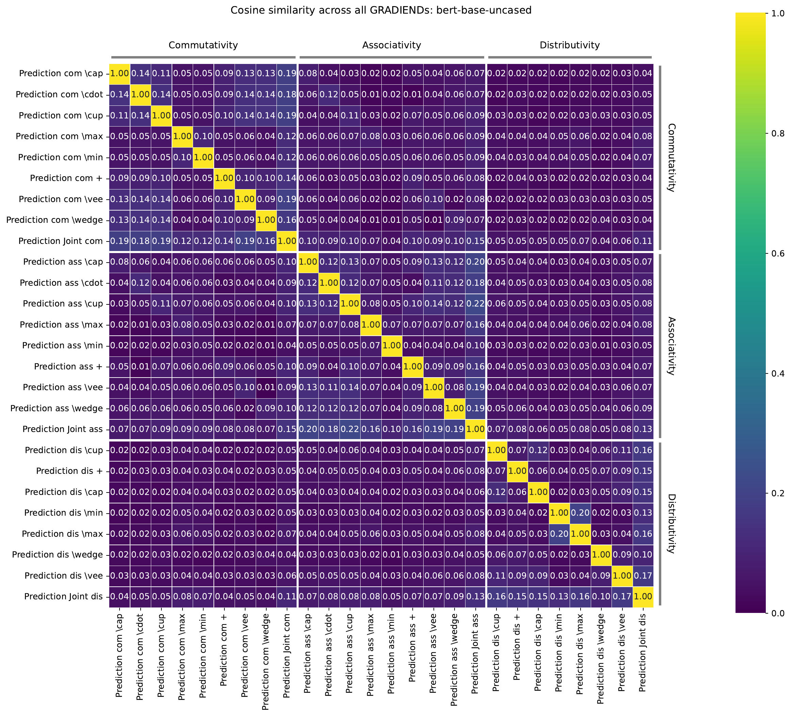
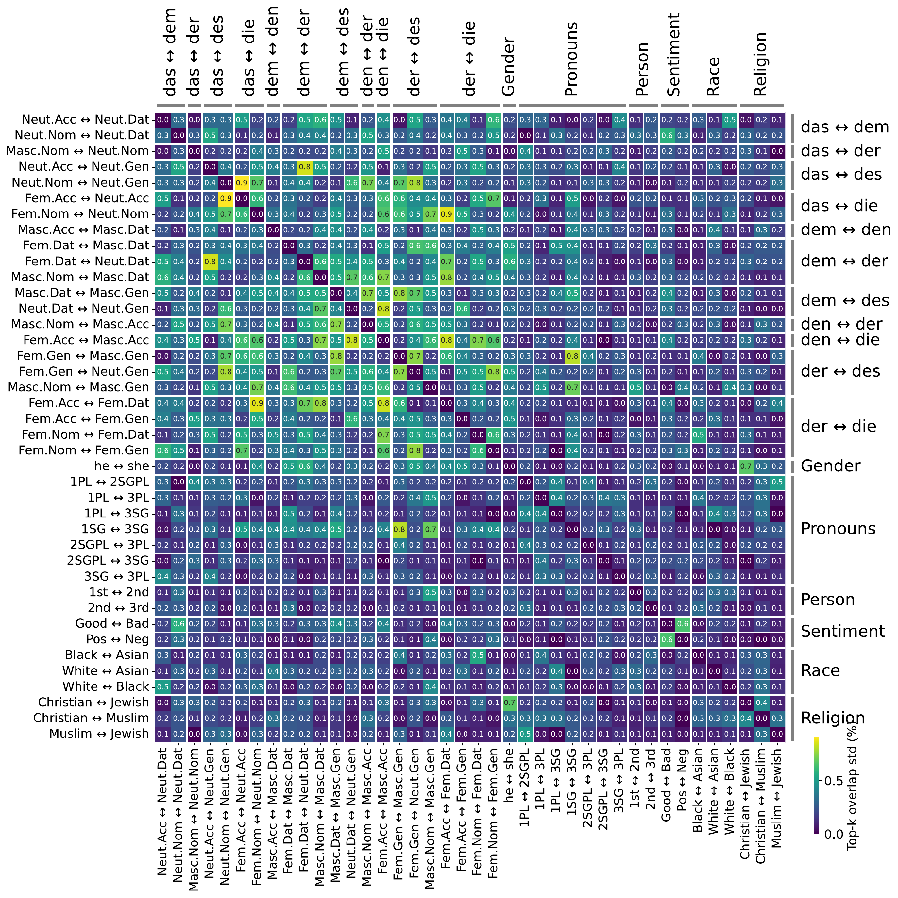
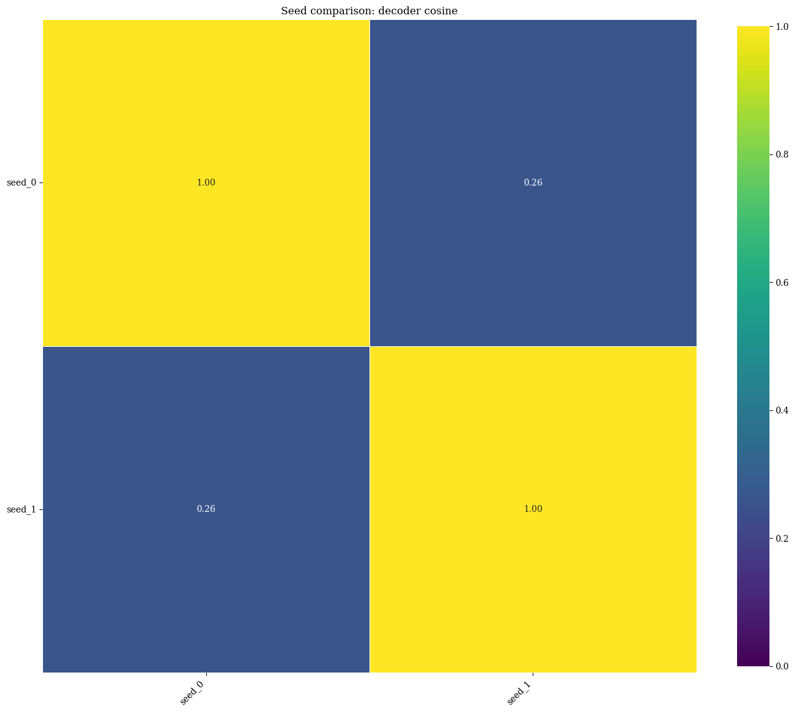
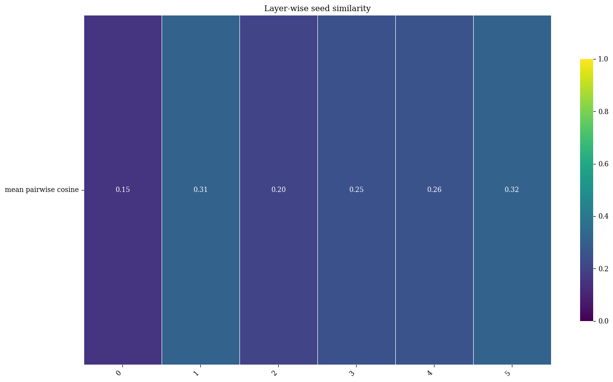

# Cross-model comparison

Cross-model comparison asks whether two or more trained GRADIENDs **agree on where
and what** they learned. Models may differ by class pair, base model, training
objective, or random seed.

Start with the tutorial [Evaluation (inter-model)](../tutorials/evaluation-inter-model.md),
then use this guide to pick the right metric.

---

## Which comparison to run

Pick one lens per question: **where** weights changed (top-k, cosine), **what signal**
they encode on data (cross-encoding), or **how stable** training was across seeds
(dispersion). These views complement each other — high parameter overlap with low
cross-encoding is a common and informative pattern (see [Cross-encoding](#cross-encoding)).

| Metric | Measures | Does *not* tell you | Advantages | Disadvantages                                                                                                                                                                             |
|--------|----------|---------------------|------------|-------------------------------------------------------------------------------------------------------------------------------------------------------------------------------------------|
| Top-k overlap | Overlap of each model's top-*k* important parameters (e.g. decoder weights) | Whether encoders separate another feature's gradients | Fast; scales to many runs; easy to read (Venn or heatmap) | Ignores weights outside top-*k*; sensitive to pre-prune topk                                                                                                                              |
| Cosine similarity | Agreement of full importance vectors (optionally top-*k* filtered or grouped by layer/component) | Per-token probability shifts or rewrite quality | Uses magnitudes and directions, not just set membership; supports grouped breakdowns | Less intuitive than overlap; high cosine can still disagree on which parameters matter most; **not well tested**                                                                          |
| Cross-encoding | How well one GRADIEND's encoder separates another feature's snippets | Whether the same parameters were modified | Tests semantic signal on data; separates "same place, different feature" from entanglement | Requires encoder eval (additional computations); slower and setup-heavy                                                                                                                   |
| Seed dispersion | Spread of scalar metrics (e.g. encoder correlation) across convergent seeds | Whether any single seed converged; weight-space overlap between seeds | Compact reproducibility summary alongside means ([Multi-seed analysis](multi-seed.md)) | Needs `analyze_seed_stability` and multiple convergent seeds; use [checkpoint similarity](#checkpoint-similarity-weight-space) for weight agreement; does not compare different features! |

---

## Comparison payloads

Most comparison functions return a dict usable for plotting or tables:

- `model_ids` — row labels
- `matrix` — numeric values
- `column_ids` — column labels (rectangular comparisons)
- `n_matrix`, `cell_stats` — optional counts and seed dispersion

Plot with [`plot_comparison_heatmap(comparison_data, ...)`][gradiend.visualizer.heatmaps.base.plot_comparison_heatmap] or suite helpers below.

---

## Top-k overlap

Best **first** comparison: easy to interpret, cheap to compute.

```python
suite.plot_similarity_heatmap(metric="topk_overlap", value="intersection_frac")
# or standalone:
from gradiend.visualizer.topk.pairwise_heatmap import plot_topk_overlap_heatmap
models = {t.run_id: t.get_model() for t in trainers}
plot_topk_overlap_heatmap(models, topk=1000, value="intersection_frac")
```

**Cell metric (`value`)** — what each heatmap cell shows:

| `value` | Meaning | Use when |
|---------|---------|----------|
| `"intersection"` | Raw count \|A ∩ B\| (API default) | Same `topk` everywhere; you want absolute overlap counts |
| `"intersection_frac"` | \|A ∩ B\| / min(\|A\|, \|B\|) — fraction of the **smaller** top-*k* set in the intersection | Comparing runs with different pruning or resolved set sizes; values lie in [0, 1] |

Also set `part` (`decoder-weight`, `encoder-weight`, …) and `topk` (count or fraction, e.g. `0.01` for top 1%). Full option list: [Top-k overlap heatmap](evaluation-visualization.md#topk-overlap-heatmap).

[:material-file-code-outline: `train_gender_de_detailed.py`](https://github.com/aieng-lab/gradiend/blob/main/gradiend/examples/train_gender_de_detailed.py)

**High overlap** → runs may reuse the same parameter subspace. **Low overlap** →
distinct learned directions. This says nothing about whether one encoder separates
another feature's gradients — use cross-encoding for that.

<!-- DOC_PLOT: docs/img/topk_overlap_heatmap.png
Regenerate: gradiend/examples/train_gender_de_detailed.py
Copy from experiment_dir or pass output_path when plotting.
See also evaluation-visualization.md section 4.
-->


---

## Similarity metrics

Cosine and rank-style metrics compare **full** importance vectors, not only a top-k cut.

```python
suite.plot_similarity_heatmap(measure="cosine", part="decoder-weight", topk=1000)
```

Component grouping (`embedding`, `attention`, `mlp`, `layer`, `lm_head`) follows
Hugging Face naming. Custom architectures may need explicit `group_by` or ungrouped
inspection.



---

## Cross-encoding

**Semantic** comparison: how well one GRADIEND's encoder separates another feature's data.

```python
suite.plot_cross_encoding_heatmap()
```

- High parameter overlap + low cross-encoding → same location, different feature signal.
- High cross-encoding off-diagonal → feature entanglement or shared representation.

For **dense multilingual matrices** (shared test pool, anchor-aligned squares), see
[Oriented cross-encoding matrix](cross-encoding-matrix.md).

<!-- DOC_PLOT: docs/img/suite_cross_encoding_heatmap.png
Regenerate: gradiend/examples/train_sentiment_positive_suite.py
Copy: runs/examples/sentiment_positive_suite/suite_cross_encoding_heatmap.png -> docs/img/
-->

---

## Comparing seeds

Seed comparison is [cross-model comparison](cross-model-comparison.md) where the only
deliberate difference is random initialization. Train and aggregate metrics with
[Multi-seed analysis](multi-seed.md) first; then compare **checkpoints** in weight
space if you need to know whether convergent seeds learned the same parameters.

### Metric stability (multi-seed view)

```python
view = trainer.multi_seed(selection="all_convergent", dispersion="std")
multi = view.evaluate_encoder(split="test")
print(multi["correlation"])                   # mean across seeds
print(multi["seeds"]["stats"]["correlation"]) # std, min, max, n
```

Report `multi["seeds"]["n"]` alongside means. Low encoder dispersion + high checkpoint
overlap → stable feature.



Most cells are at 0.0 or close to it, meaning the matched-seed top-k overlap percentages are effectively identical across the three BERT runs. 
In this example plot, even a brighter value around 0.7 means a standard deviation of only 0.7 percentage points, for example overlap values near 41.3%, 42.0%, and 42.7% around a 42% mean.

### Checkpoint similarity (weight space)

To compare different checkpoints of the same feature (different GRADIEND models trained on different random seeds), use the `compute_similarity_matrix` helper.

```python
from gradiend import compute_similarity_matrix, plot_comparison_heatmap

view = trainer.multi_seed(selection="all_convergent")
group = view.get_model(gradiend_only=True)  # SeedModelGroup when N > 1

comparison = compute_similarity_matrix(
    group,
    measure="topk_overlap",   # or "cosine"
    part="decoder-weight",
    topk=1000,
)
plot_comparison_heatmap(
    comparison,
    output_path="seed_topk_overlap.png",
    title="Top-k overlap across convergent seeds",
    show=False,
)
```

| Plot | What it shows |
|------|---------------|
| Pairwise top-k overlap | Shared high-importance parameters between seeds |
| Pairwise decoder cosine | Full decoder-vector agreement |
| Layer-wise similarity | Mean pairwise cosine per layer ([`compute_grouped_similarity_matrices`][gradiend.comparison.similarity.compute_grouped_similarity_matrices], `group_by="layer"`) |


<!-- DOC_PLOT: docs/img/seed_comparison_topk_overlap.png
Regenerate: python -m gradiend.examples.train_multi_seed_stability --write-docs-images
-->



<!-- DOC_PLOT: docs/img/seed_comparison_decoder_cosine.png
Regenerate: python -m gradiend.examples.train_multi_seed_stability --write-docs-images
-->



<!-- DOC_PLOT: docs/img/multi_seed_layerwise_similarity.png
Regenerate: python -m gradiend.examples.train_multi_seed_stability --write-docs-images
-->

[:material-file-code-outline: `train_multi_seed_stability.py`](https://github.com/aieng-lab/gradiend/blob/main/gradiend/examples/train_multi_seed_stability.py)
(`run_seed_comparison_heatmaps()`)
