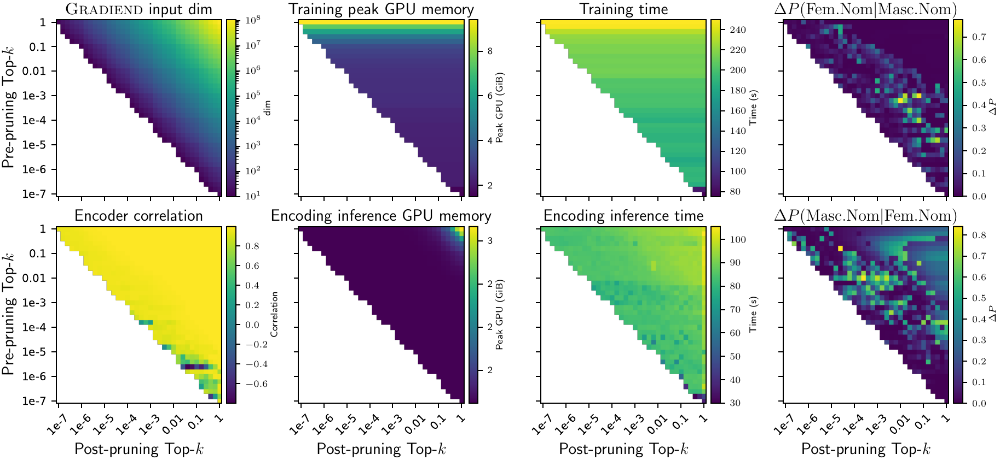

# Pruning guide

This guide explains pruned GRADIEND models, manual masks, and automated pre-/post-pruning.

## What is a pruned GRADIEND model?

A pruned GRADIEND model has a reduced input dimension. Pruning selects a subset of input dimensions (typically the most important dimensions w.r.t. feature importance) and physically shrinks the encoder/decoder weights. This is done via [`ModelWithGradiend`][gradiend.model.model_with_gradiend.ModelWithGradiend].prune_gradiend(), which delegates to [`ParamMappedGradiendModel`][gradiend.model.param_mapped.ParamMappedGradiendModel].prune().
A pruned model has fewer parameters and lower memory usage, but *may* lose some performance (typically, pruning by a few orders of magnitudes can be done with minimal loss).

Pruning is optional and can be done at different stages:

- Manual masks: apply a custom mask to keep selected dimensions.
- Pre-pruning: estimate importance from gradient statistics and prune before training.
- Post-pruning: use weight-based importance and prune after training.

## Manual masks

Use a boolean mask of shape `(input_dim,)` to keep only selected dimensions. Selection order is:

1. mask (boolean mask of which dimensions to keep)
2. threshold (keep dimensions with importance above threshold; importance is determined by `part`)
3. topk  (keep top-k important dimensions; importance is determined by `part`; can be integer or float for percentage)

```python
model = trainer.get_model()
mask = model.get_enhancer_mask(topk=0.05, part="decoder-weight")
model.prune_gradiend(mask=mask, inplace=True)
```

Notes:

- `part` must be one of: `encoder-weight`, `decoder-weight`, `decoder-bias`, `decoder-sum` (use `decoder-weight` for decoder weight–based importance). Importance is determined by the absolute value of the weights or gradients in that part.
- `mask` must be `torch.bool` with length equal to the current `input_dim`.
- `inplace` determines whether to modify the model in place or return a new pruned model. If `inplace=True`, the original model is modified and returned. If `inplace=False`, a new pruned model is returned and the original model remains unchanged.
- If `return_mask=True`, you can inspect the combined mask.

## Pre-pruning (before training)

Pre-pruning estimates importance from gradient statistics and then prunes before training.

```python
from gradiend.trainer import PrePruneConfig

args = TrainingArguments(
    ...,
    pre_prune_config=PrePruneConfig(n_samples=16, topk=0.1, source="diff"),
)
```

This [`PrePruneConfig`][gradiend.trainer.core.pruning.PrePruneConfig] will sample 16 batches from the training data, compute their gradients (for the `diff` source), and keep the top 10% most important dimensions based on those gradients. The pruned model is then trained as usual.

While pre-pruning is applied automatically, when provided in [`TrainingArguments`][gradiend.trainer.core.arguments.TrainingArguments], you can also call [`trainer.pre_prune()`][gradiend.trainer.trainer.Trainer.pre_prune] directly:

```python
trainer.pre_prune(inplace=True) # inplace or return a new pruned model
```

## Post-pruning (after training)

Post-pruning uses weight-based importance and prunes after training. When you set `post_prune_config` on [`TrainingArguments`][gradiend.trainer.core.arguments.TrainingArguments], **`train()` runs `post_prune()` automatically** after training and saves the pruned model to the run output directory. You do not need to call `post_prune()` yourself in that case.

```python
from gradiend.trainer import PostPruneConfig

args = TrainingArguments(
    ...,
    post_prune_config=PostPruneConfig(topk=0.05, part="decoder-weight"),
)
```

This [`PostPruneConfig`][gradiend.trainer.core.pruning.PostPruneConfig] will keep the top 5% most important dimensions based on the absolute value of the decoder weights. The pruned model is saved to the run output directory (e.g. `runs/experiment_name/model/`).

> Note that post-pruning further reduces the input dimension size in addition to any pre-pruning that was done. So if you use both, the final input dimension is determined by the combined effect of both pruning steps.

Valid `part` values: `encoder-weight`, `decoder-weight`, `decoder-bias`, `decoder-sum`.

To run post-prune manually (e.g. without `post_prune_config`):

```python
trainer.post_prune()
```

### Training cache fingerprint (pre/post-prune)

When `use_cache=True` or `use_cache="only_convergent"`, the trainer stores a `cache_fingerprint` in each run’s `training.json` and compares it before reusing a checkpoint. If you change [`PrePruneConfig`][gradiend.trainer.core.pruning.PrePruneConfig] fields (e.g. `n_samples`, `topk`, `source`), [`PostPruneConfig`][gradiend.trainer.core.pruning.PostPruneConfig], `reuse_pre_prune`, or `source`/`target`, the old checkpoint is rejected and training runs again. You will see a log line such as:

```
Rejecting training cache at …: fingerprint mismatch on 'pre_prune_config' (expected=…, saved=…).
```

This prevents silently reusing a model pruned with different settings. Set `use_cache=False` to force retraining regardless of fingerprint, or `use_cache="always"` to reuse without fingerprint checks.

> **Incomplete coverage:** The fingerprint is intentionally narrow (pruning + source/target today). It is likely not complete for all settings that matter to reproducibility — e.g. `params`, training loop hyperparameters, and dataset composition are not part of the check yet. Do not assume cache reuse means two runs were equivalent beyond the fingerprinted fields.

### Caching pre-prune across seeds

When `max_seeds > 1`, pre-pruning can be expensive. Set `reuse_pre_prune=True` on [`TrainingArguments`][gradiend.trainer.core.arguments.TrainingArguments] to cache the selected `keep_idx` under `experiment_dir/cache/pre_prune/` for the duration of a single `train()` call (reused across seeds). 
```python
args = TrainingArguments(
    ...,
    pre_prune_config=PrePruneConfig(n_samples=16, topk=0.01),
    reuse_pre_prune=True,
)
```


## When to use which

- Use pre-pruning to reduce training cost and memory early. However, pre-pruning is based on gradient estimates and may be less accurate, so it can lead to more performance loss if too aggressive. Recommended to use a small `n_samples` (e.g. 16) and a moderate `topk` (e.g. 0.01–0.05) for pre-pruning.
- Use post-pruning to compress after training while preserving learned behavior. Post-pruning is based on the final weights and is typically more accurate for selecting important dimensions, so it can achieve higher compression with less performance loss.
- Use manual masks for deterministic selection or when you already have a mask from an external analysis.



<!-- DOC_PLOT: docs/img/pruning_analysis_metric_grid.png
Regenerate: pruning ablation analysis; copy runs/paper/pruning_analysis_metric_grid.pdf
-->
