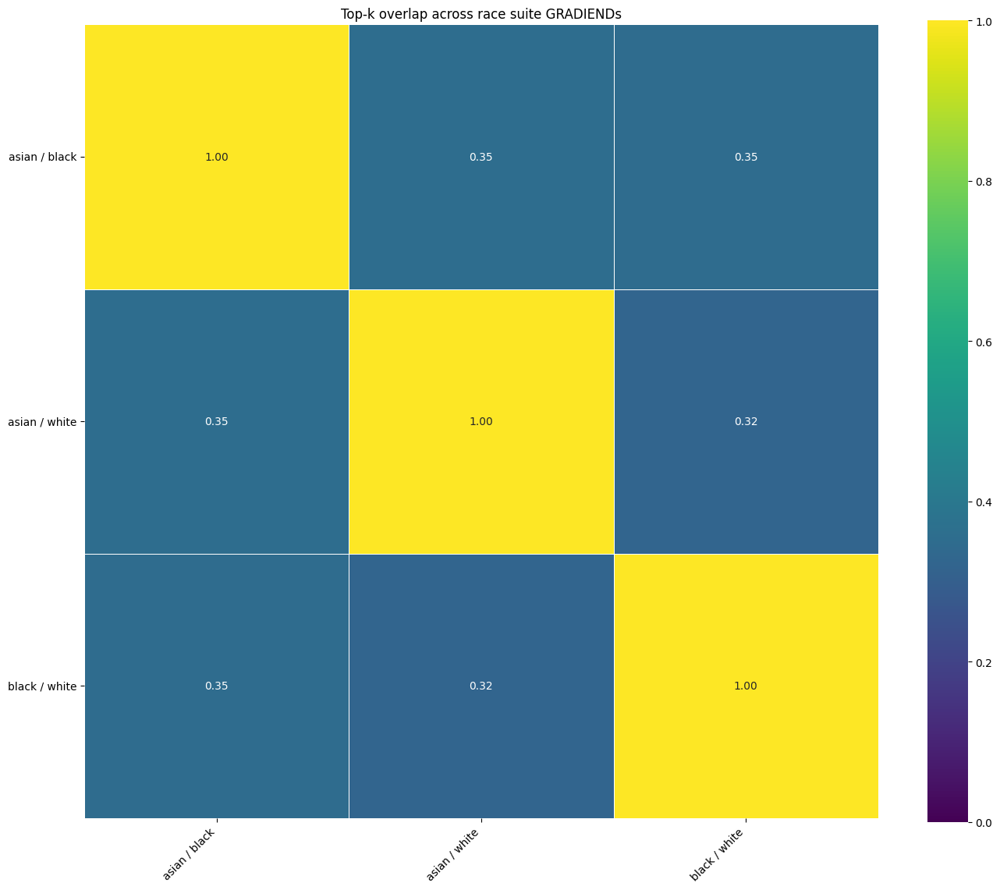
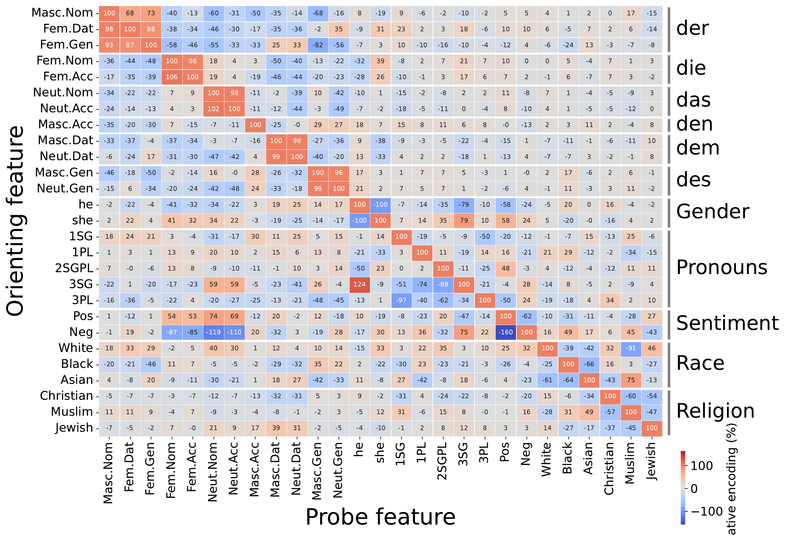
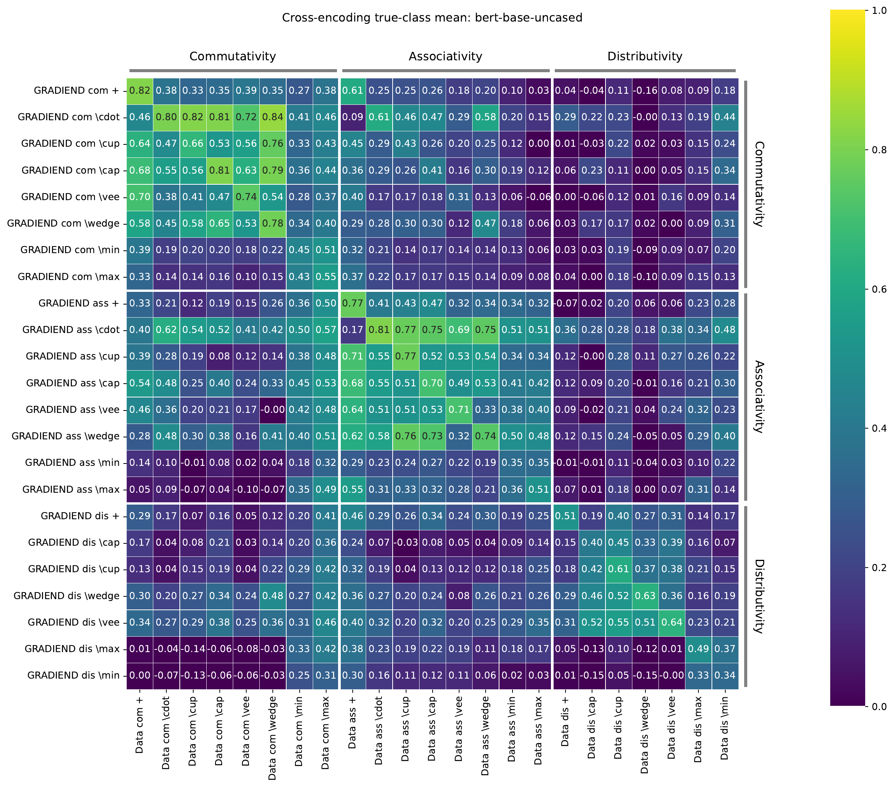

# Trainer suites

Assume you need to train **multiple GRADIEND models** that share the same
[`TrainingArguments`][gradiend.trainer.core.arguments.TrainingArguments] (and usually the same data). You can:

1. **Use a trainer suite** — [`SymmetricTrainerSuite`][gradiend.trainer.suite.symmetric.SymmetricTrainerSuite] or [`PositiveTrainerSuite`][gradiend.trainer.suite.positive.PositiveTrainerSuite] builds
   one child per pair from shared constructor kwargs and provides suite-level
   evaluation and comparison (similarity heatmaps, cross-encoding, etc.).
2. **Use a trainer collection** — [`TrainerCollection`][gradiend.trainer.suite.collection.TrainerCollection] groups trainers you already
   built (or flattens several suites) when children differ in data, args, or how
   they were constructed. Pass trainers directly; ids come from each
   `trainer.run_id`.
3. **Do it fully manually** — create trainers, call `train()` on each, load models,
   and run comparison plots yourself (only when you do not need grouped `train()`).

A **suite** is worth it when many related pairwise runs share one trainer class and
mostly shared kwargs. A **collection** is worth it when you need one place to train
or iterate heterogeneous runs (e.g. several suites plus a lone trainer for a
cross-task heatmap).

---

## Suite vs collection — which tool?

| Situation | Use |
|-----------|-----|
| Same trainer class, shared data/args, pairs from `target_classes` or `pair_definitions` | [`SymmetricTrainerSuite`][gradiend.trainer.suite.symmetric.SymmetricTrainerSuite] or [`PositiveTrainerSuite`][gradiend.trainer.suite.positive.PositiveTrainerSuite] |
| Mix hand-built trainers, or combine several suites / a suite + extra trainers | [`TrainerCollection`][gradiend.trainer.suite.collection.TrainerCollection] |
| One-off single GRADIEND | [`TextPredictionTrainer`][gradiend.trainer.text.prediction.trainer.TextPredictionTrainer] only |

[`TrainerCollection`][gradiend.trainer.suite.collection.TrainerCollection] does **not** generate children from pair definitions and does
**not** provide suite comparison plots ([`plot_similarity_heatmap`][gradiend.visualizer.heatmaps.similarity.plot_similarity_heatmap], etc.). Use it to
`train()` a fixed set of trainers and to obtain a flat `trainers` dict for
comparison helpers ([`compute_similarity_matrix`][gradiend.comparison.similarity.compute_similarity_matrix], [`plot_cross_encoding_heatmap`][gradiend.visualizer.heatmaps.encoding.plot_cross_encoding_heatmap], …)
that take `Dict[str, Trainer]`.

---

## Symmetric vs positive — which suite?

Each child GRADIEND still trains on two `target_classes`. The suite type only
matters for **how those pairs are defined**:

- **[`SymmetricTrainerSuite`][gradiend.trainer.suite.symmetric.SymmetricTrainerSuite]** — neither class is privileged (e.g., genders, races, articles, pronouns)
- **[`PositiveTrainerSuite`][gradiend.trainer.suite.positive.PositiveTrainerSuite]** — each contrast has a **positive** and **negative**
  pole (e.g., good vs bad, formal vs informal, commutative vs non-commutative).

Quick check: if swapping the two class names would change what the contrast
*means*, use [`PositiveTrainerSuite`][gradiend.trainer.suite.positive.PositiveTrainerSuite]. If `A` vs `B` is the same task as `B` vs
`A`, use [`SymmetricTrainerSuite`][gradiend.trainer.suite.symmetric.SymmetricTrainerSuite].

---

## [`SymmetricTrainerSuite`][gradiend.trainer.suite.symmetric.SymmetricTrainerSuite]

Use when classes are **peers** — no class is inherently the “positive” side.
Pass `target_classes`; the suite trains one child GRADIEND per unordered pair.

```python
from gradiend import (
    SymmetricTrainerSuite,
    TextPredictionTrainer,
    TrainingArguments,
)

RACE_CLASSES = ["asian", "black", "white"]

suite = SymmetricTrainerSuite(
    TextPredictionTrainer,
    model="distilbert-base-cased",
    data="aieng-lab/gradiend_race_data",
    eval_neutral_data="aieng-lab/biasneutral",
    target_classes=RACE_CLASSES,
    args=TrainingArguments(
        experiment_dir="runs/race_suite",
        max_steps=100,
        fail_on_non_convergence=True,
    ),
)

suite.train()
```

[:material-file-code-outline: `train_race_symmetric_suite.py`](https://github.com/aieng-lab/gradiend/blob/main/gradiend/examples/train_race_symmetric_suite.py)

This yields three children — `asian__black`, `asian__white`, and `black__white` —
one [`TextPredictionTrainer`][gradiend.trainer.text.prediction.trainer.TextPredictionTrainer] per `combinations(RACE_CLASSES, 2)`. Default `child_id`
values sort the two class names alphabetically (`black__white`, not `white__black`).
Regardless of how you choose children (see below), construction always builds one
trainer per child, stores checkpoints under `experiment_dir/<run_id>/<child_id>/`,
and validates that each pair has training transitions in the data.

```python
list(suite.pair_definitions)   # child ids, e.g. "black__white"
suite.get_trainer("black__white")
```

### Choosing children

| You pass | What happens |
|----------|----------------|
| `target_classes=["a","b","c"]` | All `combinations(..., 2)` — as in the example above |
| `target_pairs=[("a","b"), ("a","c")]` | Only those pairs; default `child_id` / `label` |
| `pair_definitions=[SuitePairDefinition(...), ...]` | Explicit manifest — full per-child control |
| Nothing explicit | Classes inferred from data columns / HF per-class layout |

### Subset of pairs with `target_pairs`

When you do not want every combination, list the pairs explicitly. Default checkpoint
names stay `classA__classB`:

```python
SymmetricTrainerSuite(
    TextPredictionTrainer,
    model="distilbert-base-cased",
    data="aieng-lab/gradiend_race_data",
    target_classes=["asian", "black", "white"],
    target_pairs=[("white", "black"), ("white", "asian")],
    args=TrainingArguments(experiment_dir="runs/race_subset", max_steps=100),
)
```

Two children: `black__white` and `asian__white` (`black`/`asian` omitted).

### Full control with `pair_definitions`

Use `pair_definitions` when you need custom `child_id` or `label` per child (e.g.
stable run names for a paper). Each child is one [`SuitePairDefinition`][gradiend.trainer.suite.definitions.SuitePairDefinition]:

| Field | Role |
|-------|------|
| `target_classes` | **(required)** The two classes this child trains on |
| `child_id` | Checkpoint subdir and `suite.get_trainer(...)` key (default: `classA__classB`, classes sorted A≤B) |
| `label` | *(optional)* Name on suite comparison plots (default: `A <-> B`) |

Same two-pair subset as `target_pairs` above, with explicit ids:

```python
from gradiend import (
    SuitePairDefinition,
    SymmetricTrainerSuite,
    TextPredictionTrainer,
    TrainingArguments,
)

suite = SymmetricTrainerSuite(
    TextPredictionTrainer,
    model="distilbert-base-cased",
    data="aieng-lab/gradiend_race_data",
    pair_definitions=[
        SuitePairDefinition(
            target_classes=("white", "black"),
            child_id="race_white_black",
        ),
        SuitePairDefinition(
            target_classes=("white", "asian"),
            child_id="race_white_asian",
        ),
    ],
    args=TrainingArguments(experiment_dir="runs/race_subset", max_steps=100),
)

suite.train()
```

---

### What you can do after training

```python
# Per-child access (same API as a single trainer)
trainer = suite.get_trainer("black__white")
trainer.evaluate_decoder(plot=True)
```

```python
# Encoder eval on every child (cached per child under experiment_dir)
suite.evaluate_encoder(split="test", plot=True, full_eval=True)
```

```python
suite.plot_topk_overlap_heatmap(topk=1000, value="intersection_frac", output_path="suite_topk_overlap.png")
```

<!-- DOC_PLOT: docs/img/symmetric_suite_topk_overlap.png
Regenerate: gradiend/examples/train_race_symmetric_suite.py (--write-docs-images)
-->



```python
suite.plot_cross_encoding_heatmap(
    ["white", "black", "asian"],
    split="test",
    alignment="counterfactual",
    output_path="suite_cross_encoding.png",
)
```

<!-- DOC_PLOT: docs/img/symmetric_suite_cross_encoding.png
Regenerate: gradiend/examples/train_race_symmetric_suite.py (--write-docs-images)
-->



[:material-file-code-outline: `train_race_symmetric_suite.py`](https://github.com/aieng-lab/gradiend/blob/main/gradiend/examples/train_race_symmetric_suite.py)

### Larger demos

For cross-task grids beyond one homogeneous suite:

[:material-file-code-outline: `multilingual_gradiend_demo_small.py`](https://github.com/aieng-lab/gradiend/blob/main/experiments/multilingual_gradiend_demo_small.py)

[:material-file-code-outline: `multilingual_gradiend_demo.py`](https://github.com/aieng-lab/gradiend/blob/main/experiments/multilingual_gradiend_demo.py)

See [Oriented cross-encoding matrix](cross-encoding-matrix.md).

---

## [`PositiveTrainerSuite`][gradiend.trainer.suite.positive.PositiveTrainerSuite] (directed positive vs negative)

Use this suite when each contrast has a **privileged positive direction**: sentiment (good vs bad),
property present vs absent, etc.

```python
from gradiend import (
    PositiveFeatureDefinition,
    PositiveTrainerSuite,
    TextPredictionTrainer,
    TrainingArguments,
)

suite = PositiveTrainerSuite(
    TextPredictionTrainer,
    model="bert-base-uncased",
    data=training_data,
    eval_neutral_data=neutral_data,
    positive_feature_definitions=[
        PositiveFeatureDefinition(
            positive_feature_class="good",
            negative_feature_class="bad",
        ),
        PositiveFeatureDefinition(
            positive_feature_class="happy",
            negative_feature_class="sad",
        ),
    ],
    args=TrainingArguments(
        experiment_dir="runs/sentiment_suite",
        max_steps=500,
        fail_on_non_convergence=True,
    ),
)

suite.train()
suite.evaluate_encoder(split="test")
suite.plot_similarity_heatmap(measure="cosine", output_path="suite_similarity.png")
suite.plot_cross_encoding_heatmap(
    output_path="suite_cross_encoding.png",
)
```

[:material-file-code-outline: `train_sentiment_positive_suite.py`](https://github.com/aieng-lab/gradiend/blob/main/gradiend/examples/train_sentiment_positive_suite.py)

Default `mode="single"`: one child GRADIEND per [`PositiveFeatureDefinition`][gradiend.trainer.suite.definitions.PositiveFeatureDefinition] above.

### [`PositiveFeatureDefinition`][gradiend.trainer.suite.definitions.PositiveFeatureDefinition]

| Field | Role |
|-------|------|
| `positive_feature_class` | Class treated as the positive pole |
| `negative_feature_class` | Opposite pole |
| `label` | *(optional)* Display name in plots |

Each definition becomes one child: `positive_feature_class` vs `negative_feature_class`,
with `positive_class` stored on the pair for cross-encoding.

### Cross-encoding on positive suites

```python
suite.plot_cross_encoding_heatmap(
    metric="positive_mean",   # or "negative_mean", "positive_minus_negative"
    normalize=False,          # True: divide each row by its diagonal
)
```

Cell `(A, B)`: how well GRADIEND trained for pair A encodes data from contrast B,
with sign aligned to A’s positive class. See [Cross-model comparison](cross-model-comparison.md).

<!-- DOC_PLOT: docs/img/suite_similarity_heatmap.png
Regenerate: gradiend/examples/train_sentiment_positive_suite.py (--write-docs-images)
-->


<!-- DOC_PLOT: docs/img/suite_cross_encoding_heatmap.png
Regenerate: gradiend/examples/train_sentiment_positive_suite.py (--write-docs-images)
-->



### Optional: `mode="all_but_one"`

**Purpose:** train one GRADIEND per leave-one-out holdout. Each child learns a single
`positive` vs `negative` axis by merging *all other* word pairs — useful when you want
a union-of-contrasts model with one feature (or group) excluded, e.g. to test whether
a GRADIEND trained without valence still encodes valence transitions.

Compare with the example above (`mode="single"`): there you get one child per pair.
Here you get one child per held-out pair, or per held-out `feature_class_group` when
every definition sets that field.

[:material-file-code-outline: `train_sentiment_positive_suite_all_but_one.py`](https://github.com/aieng-lab/gradiend/blob/main/gradiend/examples/train_sentiment_positive_suite_all_but_one.py)

With default `--holdout group` the suite builds **four** children:

| `child_id` | Held-out group | Merged `positive` classes | Merged `negative` classes |
|------------|----------------|---------------------------|---------------------------|
| `holdout_group__quality` | quality | happy, excited, love, fast | sad, bored, hate, slow |
| `holdout_group__valence` | valence | good, love, fast | bad, hate, slow |
| `holdout_group__affection` | affection | good, happy, excited, fast | bad, sad, bored, slow |
| `holdout_group__pace` | pace | good, happy, excited, love | bad, sad, bored, hate |

With `--holdout feature` (no `feature_class_group`), you get **five** children —
one per held-out word pair (`holdout__good__bad`, `holdout__happy__sad`, …).

**Comparison plots:** use [`plot_similarity_heatmap`][gradiend.visualizer.heatmaps.similarity.plot_similarity_heatmap] (parameter overlap between
holdout models). Do **not** use [`plot_cross_encoding_heatmap`][gradiend.visualizer.heatmaps.encoding.plot_cross_encoding_heatmap] here — every child
trains on the same synthetic `positive`/`negative` classes, so cross-encoding columns
would be identical and the heatmap is flat across each row. Cross-encoding heatmaps
are for `mode="single"`, where each child has distinct word-pair `target_classes`.

---

## [`TrainerCollection`][gradiend.trainer.suite.collection.TrainerCollection]

Use when trainers are **already built** or come from **incompatible** suite configs
(different datasets, [`TrainingArguments`][gradiend.trainer.core.arguments.TrainingArguments], or pair manifests). Each passed trainer must have a
non-empty `run_id`; that becomes the collection key.

```python
from gradiend import TextPredictionTrainer, TrainerCollection, SymmetricTrainerSuite

# Hand-built trainers
good_bad = TextPredictionTrainer(..., run_id="sentiment_good_bad", ...)
trainers = TrainerCollection(good_bad, other_trainer)

# Flatten several suites and standalone trainers
trainers_by_id = TrainerCollection.merge(
    race_suite,
    religion_suite,
    gender_en_trainer,
).trainers
```

### Combining a suite with extra trainers

When one child needs different data or args than the rest of a suite, build a
[`SymmetricTrainerSuite`][gradiend.trainer.suite.symmetric.SymmetricTrainerSuite] for the homogeneous part and merge in the outlier:

```python
full_suite = SymmetricTrainerSuite(
    TextPredictionTrainer,
    pair_definitions=[...],  # positive <-> negative
    ...
)
good_bad_trainer = TextPredictionTrainer(
    ...,
    config=TextPredictionConfig(run_id="sentiment_good_bad", ...),
)

sentiment = TrainerCollection.merge(
    full_suite,
    good_bad_trainer,
    retain_models_in_memory=False,
)
sentiment.train(use_cache=True)
```

### What [`TrainerCollection`][gradiend.trainer.suite.collection.TrainerCollection] provides

| Method / attribute | Purpose |
|--------------------|---------|
| [`TrainerCollection(*trainers)`][gradiend.trainer.suite.collection.TrainerCollection] | Group trainers keyed by `trainer.run_id` |
| `TrainerCollection.merge(*parts)` | Combine [`Trainer`][gradiend.trainer.trainer.Trainer], [`TrainerSuite`][gradiend.trainer.suite.base.TrainerSuite], and/or [`TrainerCollection`][gradiend.trainer.suite.collection.TrainerCollection] |
| `.trainers` | `Dict[str, Trainer]` for comparison APIs |
| `.train(use_cache=...)` | Train every child in order |
| `.items()` / `.get_trainer(id)` | Same iteration pattern as [`TrainerSuite`][gradiend.trainer.suite.base.TrainerSuite] |

When flattening a [`TrainerSuite`][gradiend.trainer.suite.base.TrainerSuite], keys are the suite **child ids** from
`suite.items()` (equal to `trainer.run_id` when the suite has no parent `run_id`).

**Memory:** `retain_models_in_memory=False` unloads each child after an uncached
`train()`, same idea as on [`TrainerSuite`][gradiend.trainer.suite.base.TrainerSuite].

**Not included:** suite-only analytics ([`plot_similarity_heatmap`][gradiend.visualizer.heatmaps.similarity.plot_similarity_heatmap],
[`plot_cross_encoding_heatmap`][gradiend.visualizer.heatmaps.encoding.plot_cross_encoding_heatmap] on the group, `annotate_data`, shared base-model
caching across children). For those, keep children inside one [`TrainerSuite`][gradiend.trainer.suite.base.TrainerSuite], or
call comparison functions on `collection.trainers` yourself.

---

## What every suite provides ([`TrainerSuite`][gradiend.trainer.suite.base.TrainerSuite] base)

These work on **both** symmetric and positive suites:

| Method | Purpose |
|--------|---------|
| `suite.train()` | Train every child; returns `{child_id: train_result}` |
| [`suite.evaluate_encoder(...)`][gradiend.trainer.suite.base.TrainerSuite.evaluate_encoder] | Encoder eval per child; `full_eval=True` on `split="test"` includes non-target transitions |
| [`suite.evaluate_decoder(...)`][gradiend.trainer.suite.base.TrainerSuite.evaluate_decoder] | Decoder grid per child |
| [`suite.evaluate(...)`][gradiend.trainer.suite.base.TrainerSuite.evaluate] | Full evaluate per child |
| `suite.call("method", ...)` | Forward any trainer method to all children |
| `suite.get_trainer(child_id)` | Single child [`TextPredictionTrainer`][gradiend.trainer.text.prediction.trainer.TextPredictionTrainer] |
| `suite.get_models(...)` | Load GRADIEND weights for comparison (`gradiend_only=True` skips base model) |
| `suite.compute_similarity_matrix(...)` | Numeric pairwise similarity |
| [`suite.plot_similarity_heatmap(...)`][gradiend.trainer.suite.base.TrainerSuite.plot_similarity_heatmap] | Heatmap of cosine / top-k overlap / etc. |
| [`suite.plot_topk_overlap_heatmap(...)`][gradiend.trainer.suite.base.TrainerSuite.plot_topk_overlap_heatmap] | Top-k overlap specifically |
| [`suite.plot_cross_encoding_heatmap(...)`][gradiend.trainer.suite.base.TrainerSuite.plot_cross_encoding_heatmap] | Oriented cross-encoding within one suite; see [Oriented cross-encoding matrix](cross-encoding-matrix.md) for dense multi-class grids |
| `suite.annotate_data(...)` | One annotation pass on shared data (not per child) |
| `suite.clear_model_cache()` | Free GPU memory between heavy steps |

**Memory:** `retain_models_in_memory=False` (used in
`train_sentiment_positive_suite.py`) unloads each child after training/eval so many
GRADIENDs fit on one GPU. Default is `True` (faster re-analysis, more VRAM).

**Output layout:** with `experiment_dir="runs/foo"` and `run_id="suite_name"` on the
suite (optional), child checkpoints live at
`runs/foo/suite_name/<child_id>/`. Each child is a normal trainer run with its own
caches and plots.

---

## Multi-seed suites

When children use multi-seed training (`analyze_seed_stability=True`,
`saved_seed_runs="all_convergent"`), suite comparison methods accept
`seed_selection` and `dispersion`:

```python
suite.plot_similarity_heatmap(
    seed_selection="all_convergent",
    dispersion="std",
)
```

[:material-file-code-outline: `train_multi_seed_stability.py`](https://github.com/aieng-lab/gradiend/blob/main/gradiend/examples/train_multi_seed_stability.py)


<!-- DOC_PLOT: docs/img/multi_seed_suite_dispersion_heatmap.png
Regenerate: multilingual 3-seed BERT run; copy topk_overlap_heatmap_all_1000_std.pdf
-->

This dispersion view is a stability diagnostic, not the overlap matrix itself:
each cell is the seed-to-seed standard deviation of the corresponding top-k
overlap comparison after converting overlap values to percent. A value of 0.0
means the matched-seed overlap percentages are effectively identical across
runs. A value of 0.7 means the standard deviation is 0.7 percentage points, so
overlap values near a 42% mean would typically be only about 41.3%, 42.0%, and
42.7% across seeds; even the brightest cells here are small seed effects.
The color scale is local to the observed dispersion range rather than fixed to
the 0–100 overlap scale.

Heatmap cells can then show mean comparison values with seed spread. Enable only
after single-seed children converge reliably — see [Multi-seed analysis](multi-seed.md).

---

## Related docs

- [Oriented cross-encoding matrix](cross-encoding-matrix.md) — dense GRADIEND×transition and feature-aligned matrices across many pairwise runs
- [Cross-model comparison](cross-model-comparison.md) — choosing similarity vs cross-encoding metrics
- [Evaluation (inter-model)](../tutorials/evaluation-inter-model.md) — top-k overlap tutorial
- [Evaluation & visualization](evaluation-visualization.md) — heatmap customization
